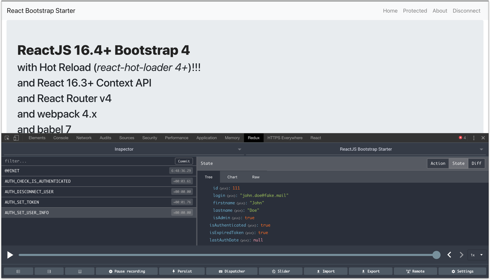

React 16 Bootstrap webpack 3 with Hot Reload STARTER
==========
[](https://github.com/MacKentoch/react-bootstrap-webpack-starter)
[](https://travis-ci.org/MacKentoch/react-bootstrap-webpack-starter)
[](https://coveralls.io/github/MacKentoch/react-bootstrap-webpack-starter?branch=master)
[](https://app.fossa.io/projects/git%2Bgithub.com%2FMacKentoch%2Freact-bootstrap-webpack-starter?ref=badge_shield)

### ReactJS + Bootstrap starter with hot reload

#### Full client and server side in ES6+-ES2015+


*Concept behind:* **this starter is an easy way to understand and ready to use ReactJS (ES6) + bootstrap + webpack starter with:**
- `no hard core Webpack` config so it is more commonly understandable (*they are numerous amazing starters with incredible webpack configs — hard core configs aren't bad things at all! —. This one is just for easier understanding for people even discovering webpack*)
- `with hot reload` (*ReactJS + webpack => hot reload = WINNER*)
- `no flux` (*yes, to give you freedom to add then since you may want to use something else like observables?*)
- `with JWT auth`
- *ReactJS Components written with `optimization tricks` (stateless, pure render...).*



> *Looking for server side rendering?* check this project with SSR added [here](https://github.com/MacKentoch/react-bootstrap-webpack-ssr-starter#react-bootstrap-with-server-side-rendering-starter)

## Breaking changes since v5.0.0
- upgrade to React 16.x
- `react-router 4+` (*read this [nice article about migrating from react-router 3 to react-router 4](https://codeburst.io/react-router-v4-unofficial-migration-guide-5a370b8905a)*)
- add few flow types (*still keep propTypes*)
- updated hot reload (*[read hot reload starter](https://gaearon.github.io/react-hot-loader/getstarted/)*)
- use `CSS module` (*keep coding style with SASS but get benefit of css module for a more peasant coding*)


## HUGE Breaking changes since 3.0.0
- upgrade to `React 15.6.x`
- upgrade to `webpack v3`
- add `JWT authentication` (protected route, logout components...)

## HUGE Breaking changes since 2.1.0
- upgrade to `react-router v4`

## HUGE Breaking changes since 2.0.0
- upgrade to `webpack 2`
- remove autoprefixer in favor of `postcss` and `cssnext`
- upgrade `React` to `15.5.4+`
 - `PropTypes` comes now from `prop-types`
- upgrade dependencies


> If you prefer a `webpack 1` version, [version 1.1.0](https://github.com/MacKentoch/react-bootstrap-webpack-starter/tree/v1.1.0) is what you are looking for.

## Detailed Content

**Front:**
- React JS (15.6.x - [github :link:](https://github.com/facebook/react))
- react-router (4.x- [github :link:](https://github.com/reactjs/react-router))
- Bootstrap (3.x - [github :link:](https://github.com/twbs/bootstrap))
- React-Bootstrap ([github :link:](https://github.com/react-bootstrap/react-bootstrap))
- font-awesome ([github :link:](https://github.com/FortAwesome/Font-Awesome))
- animate.css ([github :link:](https://github.com/daneden/animate.css))
- classnames ([github :link:](https://github.com/JedWatson/classnames))
- react-motion ([github :link:](https://github.com/chenglou/react-motion))
- Webpack 3.x ([github :link:](https://github.com/webpack/webpack))
- babel 6+ ([github :link:](https://github.com/babel/babel))
- axios ([github :link:](https://github.com/mzabriskie/axios) *Why: simple, complete, isomorphic ...*)

**Tool chain:**
- babel 6+
- eslint
- hot reload
- loaders
  - `js` / `jsx`
  - sass
  - css
  - json
  - images formats
  - svg and fonts formats
- postcss / cssnext

**tests:**
- jsdom 11+
- Mocha
- Chai (*+ dirty-chai*)
- enzyme
- Sinon
- nyc


## Usage

### Install

```bash
npm install
```
or 

```bash
yarn install
```

### bundle dev mode

```bash
npm run dev
```

### dev : hot reload mode

```bash
npm run start
```

### tests

```bash
npm run test
```

### bundle production mode


```bash
npm run prod
```

### mini node-express server

with server hot reload (*and dev bundle*):
```bash
npm run serve-dev
```

without hot reload (*and prod bundle*):
```bash
npm run serve-prod
```


## To add
- [ ] react-router v4
- [x] tests
 - [ ] 100%
- [x] coverage
- [x] hot reload
- [ ] ~~Redux~~ (*won't be added "HERE" since specific [repo `react-redux-bootstrap-webpack-starter` created here](https://github.com/MacKentoch/react-redux-bootstrap-webpack-starter)*)

## License

The MIT License (MIT)

Copyright (c) 2017 Erwan DATIN

Permission is hereby granted, free of charge, to any person obtaining a copy of this software and associated documentation files (the "Software"), to deal in the Software without restriction, including without limitation the rights to use, copy, modify, merge, publish, distribute, sublicense, and/or sell copies of the Software, and to permit persons to whom the Software is furnished to do so, subject to the following conditions:

The above copyright notice and this permission notice shall be included in all copies or substantial portions of the Software.

THE SOFTWARE IS PROVIDED "AS IS", WITHOUT WARRANTY OF ANY KIND, EXPRESS OR IMPLIED, INCLUDING BUT NOT LIMITED TO THE WARRANTIES OF MERCHANTABILITY, FITNESS FOR A PARTICULAR PURPOSE AND NONINFRINGEMENT. IN NO EVENT SHALL THE AUTHORS OR COPYRIGHT HOLDERS BE LIABLE FOR ANY CLAIM, DAMAGES OR OTHER LIABILITY, WHETHER IN AN ACTION OF CONTRACT, TORT OR OTHERWISE, ARISING FROM, OUT OF OR IN CONNECTION WITH THE SOFTWARE OR THE USE OR OTHER DEALINGS IN THE SOFTWARE.


[](https://app.fossa.io/projects/git%2Bgithub.com%2FMacKentoch%2Freact-bootstrap-webpack-starter?ref=badge_large)
